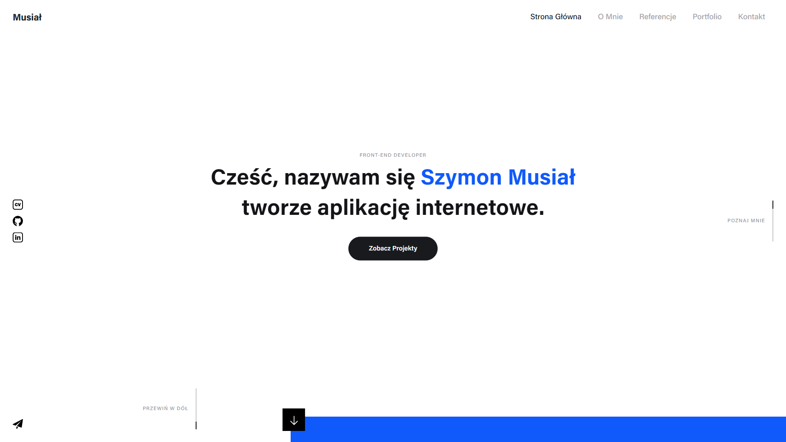

# Musialdev - Portfolio Szymon Musiał
Podgląd na żywo [musialdev.pl](https://www.musialdev.pl)

## Spis Treści
* [Ogólne Informacje](#ogólne-informacje)
* [Opis Techniczny](#opis-techniczny)
* [Podgląd Projektu](#Podgląd-projektu)
* [Technologie](#technologie)
* [Lista Zadań](#lista-zadań)
* [Status](#status)
* [Kontakt](#kontakt)

## Ogólne Informacje
Podczas tworzenia tego projektu zależało mi przede wszystkim na prostocie poruszania się po stronię. Większość sekcji została umieszczona na stronie główniej w takiej kolejności by rekruter sprawdzający moją osobę otrzymywał niezbędne informacje na danym etapie. Wielu juniorów ma bardzo podobne portfolia dlatego też zdecydowałem się na użycie animacji podczas skrolowania, dzięki której bloki które nie niosą informacji zmieniają swoją formę.

## Opis Techniczny
Sercem strony jest vue 2. Treści dostarcza headless cms strapi podłączony z cloudinary na którym trzymaną są zdjęcia. Ta integracja jest konieczna ponieważ całość stoi na Heroku który ma efemeryczny system plików. Komunikacja z cms odbywa się poprzez GraphQl. Animacje napędza MagicScroll z Gsap. Formularz kontaktowy obsługuje emailJS. Witryna jest hostowanana na netlify.

## Podgląd Projektu

## Technologie
* HTML & CSS
* Vue 2
* JavaScript
* MagicScroll
* Gsap
* Postgres
* Headless Cms Strapi
* GraphQL
* Cloudinary
* Netlify
* Heroku
* EmailJS

## Lista Zadań
* Dodanie zakładki blog

## Status
Projekt jest: rozwijany.

## Kontakt
Stworzone przez [Szymona Musiała](https://www.musialdev.pl/) - sprawdź moje portfolio!
